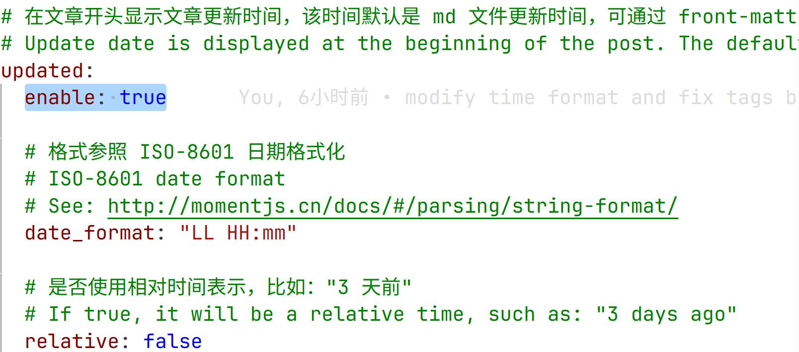

> github actions 具体配置请参考前面的文章

### 1. 问题起因
我开启了 fluid 配置的


但是在部署到 github pages 时，`hexo 并不会像我们本地运行那样，显示的是文章的更新时间，而是显示的是部署的时间。` 换句话说，你所有文章的更新时间都全部定格在 github actions 最新部署的那个时间（难绷）。


我们可以在 `front-matter` 加入 `updated: 更新时间` 解决
```yaml
title: article title
date: 2023-01-01 00:00:00

# 添加 updated: 更新时间
updated: 2023-01-01 00:00:00
```
但是很明显，这个需要我们手动去维护时间，这样很麻烦。

我们设想的是，文章的正常修改时间，就是文章的 commit 时间。

### 2. 解决方案
修改 deploy.yml
1) 指定拉取代码的深度
```yaml
uses: actions/checkout@v4
with:
  fetch-depth: 0
```
`fetch-depth: 0` 指定了拉取代码的深度。在这里，设置为 0 表示完全拉取整个代码历史，而不是仅拉取最新的部分。这样可以获取完整的 Git 历史记录。

2) 修复文件更新时间
在 build site 之前添加[^1]
```yaml
      - name: Fix File Updated Date
        run: |
          git ls-files | while read filepath; do touch -d "$(git log -1 --format='@%ct' $filepath)" "$filepath" && echo "Fixed: $filepath"; done
```
在这个脚本中，git ls-files 用于列出所有已跟踪的文件，然后通过 while read filepath 遍历每个文件。
对于每个文件，git log -1 --format='@%ct' $filepath 用于获取该文件的最后一次提交的时间戳（以秒为单位），并使用 touch -d 命令将文件的更新日期设置为相应的时间戳。
echo "Fixed: $filepath" 用于输出修复过的文件路径。

这样我们就修复了 github pages 的文章更新时间。

[^1]: 参考竹林里有冰的 github acitons 文件 [workflows/deploy.yml](https://github.com/zhullyb/zhullyb.github.io/blob/master/.github/workflows/deploy.yml)